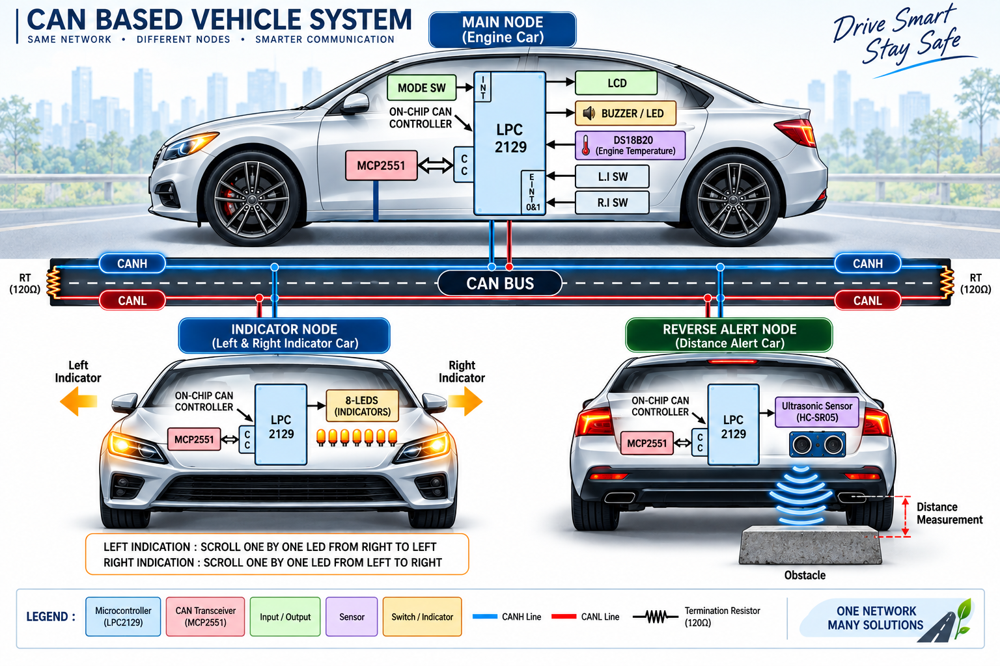
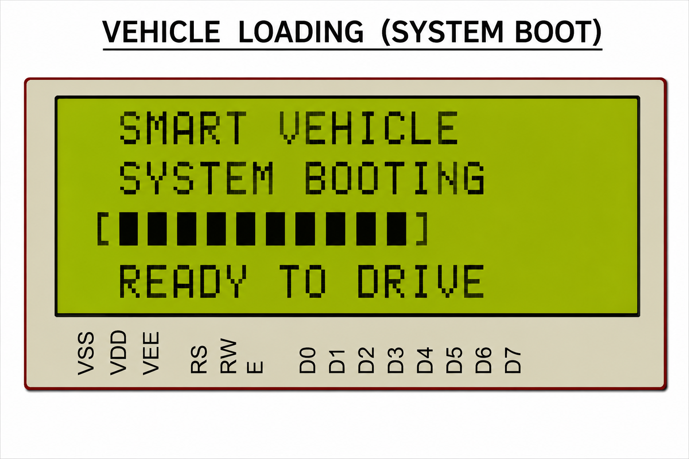
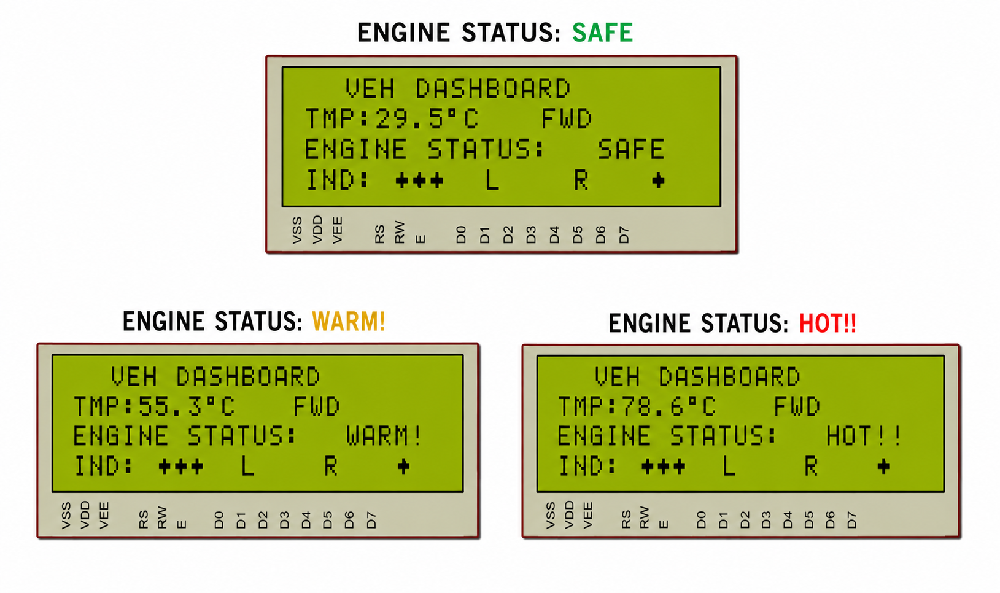
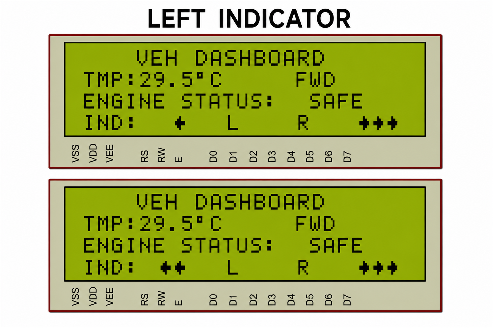
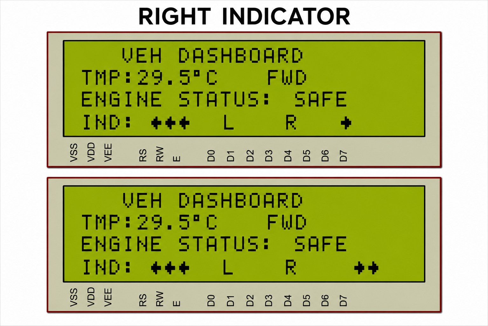
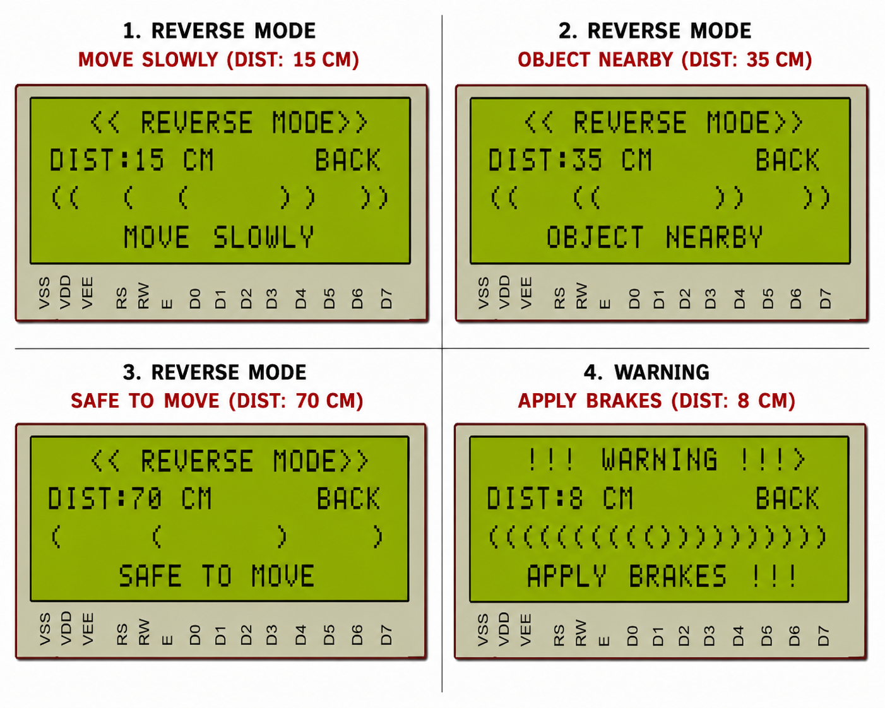

# 🚗 CAN-Based Vehicle Safety & Monitoring System

## 📖 Overview

The **CAN-Based Vehicle Safety & Monitoring System** is an automotive embedded application developed using the **LPC2129 ARM7 Microcontroller** and **Controller Area Network (CAN) Protocol**.

The project demonstrates a distributed vehicle communication architecture where multiple nodes exchange information through a CAN Bus to provide real-time monitoring, indicator control, and reverse collision warning functionality.

### Key Features

* 🌡️ Engine Temperature Monitoring
* 🚦 Vehicle Indicator Control
* 📡 CAN-Based Multi-Node Communication
* 🚗 Reverse Obstacle Detection
* 🖥️ LCD Dashboard Interface
* 🚨 Real-Time Warning Alerts
* 🔄 Distributed Embedded Architecture

---

## 🎯 Project Objective

To develop a CAN-based automotive monitoring system in which a central node continuously monitors engine temperature, manages vehicle indicators, and processes reverse sensor information to improve vehicle safety through reliable inter-node communication.

---

## 🏗️ System Architecture

### Main Node

The Main Node acts as the central controller of the system.

**Functions**

* Reads engine temperature from DS18B20
* Displays vehicle information on LCD
* Controls indicator operations
* Receives reverse alert information
* Generates safety warnings

---

### Indicator Node

The Indicator Node receives CAN messages from the Main Node and controls vehicle indicators.

**Functions**

* Left Indicator Control
* Right Indicator Control
* Indicator Animation
* CAN Message Processing

---

### Reverse Alert Node

The Reverse Alert Node continuously monitors obstacle distance using an ultrasonic sensor.

**Functions**

* Distance Measurement
* Obstacle Detection
* Reverse Safety Alerts
* CAN Data Transmission

---

## 🖼️ System Block Diagram

<p align="center">
  
</p>

---

# 🚀 Vehicle Startup Screen

The system performs initialization and dashboard activation during startup.

<p align="center">
  
</p>

**Startup Functions**

* LCD Initialization
* Sensor Readiness Check
* Dashboard Activation
* Vehicle Ready Notification

---

# 🌡️ Engine Status Monitoring

The engine temperature is continuously monitored using the DS18B20 temperature sensor.

<p align="center">
  
</p>

| Temperature Range | Status  |
| ----------------- | ------- |
| Below 40°C        | 🟢 SAFE |
| 40°C – 69°C       | 🟡 WARM |
| Above 70°C        | 🔴 HOT  |

The dashboard automatically updates the engine condition based on temperature readings.

---

# ⬅️ Left Indicator Operation

The Main Node sends CAN commands to activate the left indicator sequence.

<p align="center">
  
</p>

**Highlights**

* Sequential Arrow Animation
* CAN-Controlled Operation
* Real-Time Dashboard Update

---

# ➡️ Right Indicator Operation

The Main Node sends CAN commands to activate the right indicator sequence.

<p align="center">
  
</p>

**Highlights**

* Sequential Arrow Animation
* Real-Time CAN Communication
* Dashboard Integration

---

# 🚨 Reverse Alert System

The Reverse Alert Node continuously measures the distance behind the vehicle using the HC-SR05 ultrasonic sensor.

<p align="center">
  
</p>

### Warning Levels

| Distance   | Alert            |
| ---------- | ---------------- |
| > 50 cm    | 🟢 Safe to Move  |
| 20 – 50 cm | 🟡 Object Nearby |
| 10 – 20 cm | 🟠 Move Slowly   |
| ≤ 10 cm    | 🔴 Apply Brakes  |

The measured distance is transmitted to the Main Node through CAN communication and displayed on the LCD dashboard.

---

## ⚙️ Hardware Requirements

| Component    | Description           |
| ------------ | --------------------- |
| LPC2129      | ARM7 Microcontroller  |
| MCP2551      | CAN Transceiver       |
| DS18B20      | Temperature Sensor    |
| HC-SR05      | Ultrasonic Sensor     |
| 20x4 LCD     | Display Unit          |
| LEDs         | Indicator Simulation  |
| Buzzer       | Warning Alert         |
| Push Buttons | User Inputs           |
| USB-UART     | Programming Interface |

---

## 💻 Software Requirements

* Embedded C
* Keil uVision
* Flash Magic
* Proteus

---

## 📂 Repository Structure

```text
CAN-Based-Vehicle-Safety-Monitoring-System
│
├── Main_Node
├── Indicator_Node
├── Reverse_Alert_Node
│
├── Images
│
├── README.md
```

---

## ✅ Advantages

* Real-Time Vehicle Monitoring
* Reliable CAN Communication
* Improved Driver Safety
* Reverse Collision Warning
* Modular Multi-Node Design
* Low Latency Communication
* Scalable Architecture
* Automotive-Oriented Implementation

---

## 📚 Learning Outcomes

* Embedded C Programming
* LPC2129 ARM7 Development
* CAN Protocol Implementation
* Interrupt Handling
* Sensor Interfacing
* LCD Driver Development
* Automotive Embedded Systems
* Distributed Communication Networks

---

## 👨‍💻 Author

### Hari Chandan

Embedded Systems | Firmware Development | Automotive Electronics

Passionate about Embedded Systems, CAN Protocol, Automotive Communication Networks, and Real-Time Embedded System Design.
